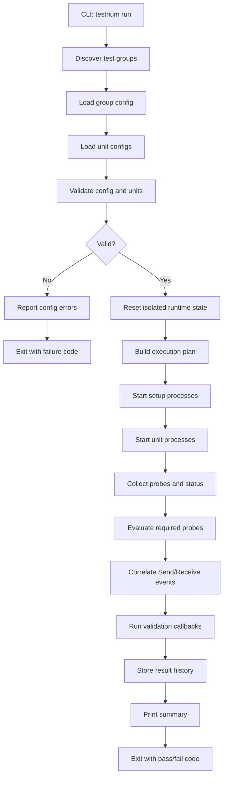
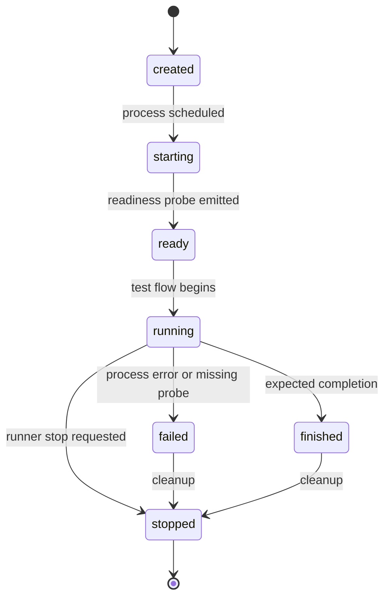
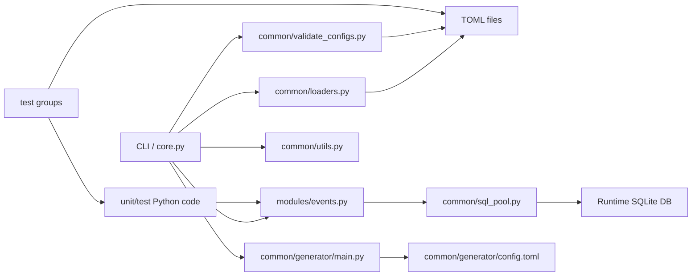
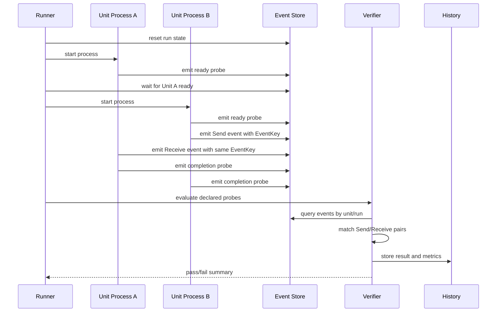
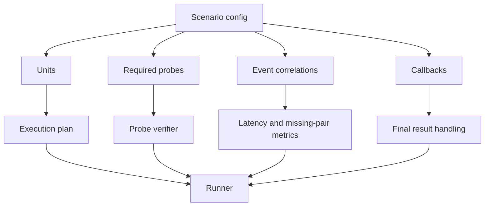

# Testrium Design Decisions

This document records the current understanding of what Testrium must solve, the logic patterns it should support, and the decisions made so far. It is intentionally focused on the framework design, not on any private project internals.

## Project Purpose

Testrium is a testing framework for systems where a test is not just one function returning a value. Its main purpose is to coordinate multiple Python processes, observe what each process does, and verify that expected behavior happened through explicit probes.

The project should focus on three core goals:

1. Run multiple Python processes with coordination and synchronization.
2. Log meaningful execution steps across those processes.
3. Probe declared events/completion tags and evaluate them at the correct point in the test flow.

## Problem Pattern

The old pattern this project should simplify is:

1. Manually reset temporary state.
2. Manually start host/client/unit processes.
3. Use fixed sleeps to guess when a process is ready.
4. Use shared status flags to decide when units should keep running or stop.
5. Write event rows into a local database.
6. Read all events after the processes finish.
7. Search event strings manually.
8. Match `Send` and `Receive` events by key to estimate communication latency.
9. Store test history manually.
10. Assert that required events happened.

Testrium should turn this into a declared scenario plus a small amount of user test code.

## Core Model

### Test Group

A test group is a folder/configured scenario containing:

- group config
- unit config files
- optional setup code
- test functions or unit runners
- optional validation callbacks

Decision: keep test groups config-driven because the framework is meant to run complex system tests where execution structure matters as much as assertions.

### Unit

A unit is one logical actor in the test, such as a host, client, worker, service, or helper process.

Each unit should define:

- `name`
- `init` order
- expected probes/events
- optional dependencies
- optional setup usage
- exception/recovery behavior

Decision: units should be first-class concepts, not just loose process targets. This lets Testrium coordinate behavior across processes instead of leaving every test to rebuild that logic.

### Process

A process is the actual Python execution for a unit or setup task.

Testrium should own:

- process start order
- readiness waiting
- timeout handling
- clean shutdown
- failure propagation
- stdout/stderr capture when requested

Decision: fixed sleeps should be replaced by readiness probes and timeouts. Sleeps make tests slow and flaky because they guess at synchronization instead of observing it.

### Probe/Event

A probe is a declared completion tag emitted by a unit while it runs. An event is the stored observation of that probe.

Recommended event shape:

```text
Unit
StepCompleted
EventType
EventKey
Time
Metadata
```

Event types should include at least:

- `Default`
- `Exception`
- `Send`
- `Receive`

Decision: keep the existing event concept because it is the clearest bridge between process behavior and test verification. Add structure around it so tests no longer need manual string scraping.

## Verification Model

Testrium should support two kinds of verification.

### Required Probes

Required probes prove that a unit completed expected milestones.

Example:

```text
Host must complete:
- initialized
- client-contacted
- callback-executed
```

Decision: required probes should be declared in config and checked by the framework. This removes repeated loops over event tables from every test.

### Event Correlation

`Send` and `Receive` probes should be matched by `EventKey`.

This allows Testrium to verify:

- a message was sent
- the matching message was received
- the elapsed communication time
- missing sends or receives
- duplicate or mismatched keys

Decision: event correlation should be a built-in primitive, because communication tests are one of the main reasons Testrium exists.

## Execution Flow

The intended runner flow is:

1. Discover test groups.
2. Load and validate group config.
3. Load and validate unit configs.
4. Reset isolated runtime state for the group.
5. Build ordered unit execution plan.
6. Start setup processes if configured.
7. Start unit processes according to dependencies/readiness.
8. Collect probes and status changes while processes run.
9. Evaluate required probes and event correlations.
10. Run optional validation callbacks.
11. Store result history.
12. Print a concise summary and return a meaningful exit code.

Decision: validation should happen before execution wherever possible. Runtime failures should be reserved for real behavior failures, not preventable config mistakes.

### Runner Flow Diagram



Decision: the runner should be responsible for the whole lifecycle. User test code should define behavior and probes, while Testrium handles orchestration, collection, verification, history, and reporting.

## Status Model

Units should have explicit lifecycle states:

```text
created
starting
ready
running
finished
failed
stopped
```

Decision: replace plain boolean running flags with lifecycle states. A boolean cannot distinguish "not started yet", "finished successfully", "failed", and "stopped by the runner".

### Unit Lifecycle Diagram



Decision: lifecycle states should be persisted or observable so other units and the runner can synchronize on real state transitions instead of sleeps.

## Configuration Decisions

Config validation should be strict.

The framework should reject:

- missing required sections
- duplicate unit `init` indexes
- sparse or invalid unit ordering
- configured units without matching files
- unit files not referenced by the group config
- invalid event declarations
- unknown recovery modes

Decision: strict config is better here because ambiguous orchestration can hide broken tests and create false confidence.

## Callback Decisions

Callbacks remain useful, but they should not be the main orchestration mechanism.

Supported callback types should include:

- per-test extra validation
- final result handling
- optional cleanup

Decision: callbacks should extend the runner, not replace the runner. Core behavior such as process startup, event collection, and required probe verification should live in Testrium itself.

## History And Metrics

Testrium should record test history generically:

- test group
- test name
- unit names
- duration
- pass/fail status
- missing probes
- completed probes
- communication latency from event correlations
- log/debug mode when available
- environment metadata when configured

Decision: history should be a framework-level feature because performance comparison is part of the README purpose and because users should not manually store history in every test.

## Local Storage Decisions

The current SQLite approach is acceptable for the first version because it is simple, local, and works across processes.

Required improvements:

- use the configured runtime path, not implicit current working directory
- isolate each test group run
- avoid global shared `Data.db` collisions
- use safe schema creation and cleanup
- avoid `eval` for config/event data

Decision: keep SQLite for MVP, but make pathing and isolation explicit. This gives us a stable base before considering other storage engines.

## Module And File Structure

This section records the current purpose of each project file and the direction it should move toward.

```text
testrium/
  core.py
  modules/
    events.py
  common/
    loaders.py
    validate_configs.py
    utils.py
    sql_pool.py
    generator/
      main.py
      config.toml
  tools/
    benchmark.py
    dashborad.py
tests/
  example_test/
  test_1/
  test_2/
docs/
  design-decisions.md
```

### File Purposes

| File | Current purpose | Intended direction |
| --- | --- | --- |
| `testrium/core.py` | CLI entrypoint and main runner loop. Discovers tests, starts setup, runs test functions, checks events, prints results. | Become the orchestrator that delegates config validation, execution planning, process lifecycle, probe verification, callbacks, and result summary. |
| `testrium/modules/events.py` | SQLite-backed event manager for recording and listing unit events. | Become the probe/event API used by unit processes and the runner, with explicit runtime pathing, structured metadata, event correlation helpers, and no implicit working-directory coupling. |
| `testrium/common/loaders.py` | Loads TOML config, test functions, callbacks, discovers test groups, resolves unit config. | Stay as I/O/discovery layer, but move schema rules into `validate_configs.py` and return structured objects instead of loosely shaped dictionaries. |
| `testrium/common/validate_configs.py` | Stub for TOML validation. | Own strict validation for group config, unit config, duplicate order indexes, missing units, disabled units, invalid event declarations, and recovery modes. |
| `testrium/common/utils.py` | Small helpers for timing decorators, assertions, output suppression, and banners. | Keep generic helpers only. Avoid putting orchestration or event logic here. |
| `testrium/common/sql_pool.py` | Basic SQLite connection pool. | Remain the low-level database helper, with clearer lifecycle/release usage and test coverage if SQLite remains the MVP store. |
| `testrium/common/generator/main.py` | Generates a config template into a target folder. | Generate complete scenario templates, including group config, unit configs, sample setup, and sample probe usage. |
| `testrium/common/generator/config.toml` | Current config template. | Become a valid minimal group config aligned with strict validation. |
| `testrium/tools/benchmark.py` | Tooling placeholder for benchmark/performance work. | Later read history results and produce comparisons. Not part of the first orchestration MVP. |
| `testrium/tools/dashborad.py` | Tooling placeholder/dashboard spelling typo. | Later become dashboard/visualization if needed; defer until the runner is stable. |
| `tests/*` | Example and regression test groups. | Become executable examples that prove Testrium can coordinate units, verify probes, and fail clearly. |
| `docs/design-decisions.md` | Design record. | Keep updated when architectural decisions change. |

Decision: keep boundaries simple. `core.py` should coordinate, `loaders.py` should load, `validate_configs.py` should validate, `events.py` should record/query probes, and storage helpers should stay below those layers.

### Module Connection Diagram



Decision: unit code should depend only on the public probe/event API, not on runner internals. This keeps user tests small and avoids coupling projects to Testrium's internal execution model.

## Process, Probe, And Verification Flow

The most important runtime connection is between unit processes, emitted probes, and the verifier.



Decision: the event store is the synchronization and evidence layer. Processes do not need direct references to each other; they emit probes, and Testrium uses those probes to coordinate and verify.

## Scenario Shape

A scenario should eventually be expressible as:

```text
test group
  units
    unit name
    start order
    dependencies
    readiness probe
    required completion probes
  event correlations
    send unit/probe
    receive unit/probe
    event key
  callbacks
    validate each test
    handle final result
```



Decision: configs should describe what must happen, not how every loop checks it. Testrium should own the repeated checking pattern.

## Naming Decisions

Use conventional prefixes for work organization:

- `feature:` for new framework capability
- `fix:` for broken behavior
- `ci:` for automation and test infrastructure
- `docs:` for documentation

Branch names should follow project conventions such as:

- `feature/...`
- `fix/...`
- `ci/...`
- `docs/...`

Decision: do not use tool-specific branch prefixes. Work should look like normal project work and remain attributable to the project owner.

## MVP Priority

The highest-priority implementation order is:

1. Make the CLI runnable and dependency-complete.
2. Add strict config/unit validation.
3. Implement unit orchestration by order, dependency, and setup policy.
4. Implement event/probe verification.
5. Add event correlation and history metrics.

Decision: orchestration and probes are the heart of Testrium. Other features, including dashboards and richer analytics, should come after the runner can reliably coordinate and verify processes.

## Non-Goals For The First Pass

The first implementation should not try to solve everything.

Defer:

- AI log analysis
- dashboard polish
- distributed/multi-machine runners
- complex visualization
- plugin systems
- broad framework rewrites

Decision: the MVP should make one scenario class work well: local multi-process Python tests with declared probes and automatic verification.

## Summary

Testrium should be the layer that turns manual multi-process tests into structured scenarios:

```text
declare units
declare probes
run coordinated processes
log what happened
verify required behavior
store the result
```

That is the central design direction.
