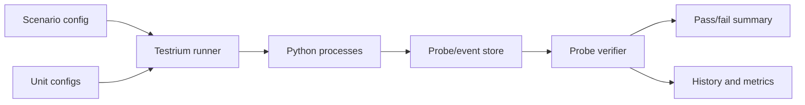

# Testrium Developer Guide

This guide explains how developers should think about Testrium and how to structure tests that need multiple Python processes, explicit coordination, and probe-based verification.

## What Testrium Is For

Use Testrium when the thing you need to test is a circuit: an event, command, request, or message that starts on one side of a system and must travel through multiple units until it activates the expected endpoint.

Testrium is not designed to replace `pytest`, `unittest`, or other direct testing tools. Those tools are excellent for testing functions, classes, API handlers, and isolated modules. Testrium is designed for circuit-level end-to-end tests where the important question is:

```text
Did the event stream travel through the whole system correctly?
```

In this context, "correctly" means:

- the source emitted the expected event
- intermediate units received and processed it
- the target endpoint was activated
- completion probes appeared in the expected units
- send/receive pairs were consistent
- latency was measurable across the circuit
- the full flow produced a clear pass/fail result

Good fits:

- a host and one or more clients
- two services exchanging messages
- an API that triggers a worker
- a module that writes to a queue and another module that consumes it
- a local microservice flow
- a process that must emit evidence before another process can continue
- an event stream that must be verified from producer to consumer
- a command that should activate a callback, endpoint, worker, or downstream module

Testrium exists for tests where success means:

```text
processes started
units synchronized
events happened
messages crossed boundaries
expected probes were completed
the whole scenario finished correctly
```

For simple pure-function tests, use `pytest` directly. For coordinated circuit behavior, use Testrium.

## Comparison With Other Test Tools

Testrium sits beside the existing ecosystem. It is not a better `pytest`; it solves a different testing shape.

| Tool or category | Primary testing target | What it proves well | What gets hard | Testrium's role |
| --- | --- | --- | --- | --- |
| `pytest` | Functions, classes, modules, fixtures | A direct call produced the expected result | Multi-process E2E flows need custom subprocess handling, sleeps, shared state, and log scraping | Use Testrium when the assertion depends on events crossing process or service boundaries |
| `unittest` | Isolated units and standard-library test cases | Deterministic direct behavior | Coordination between independent runtime actors is outside its model | Testrium adds a scenario runner for multiple actors |
| API test tools | HTTP endpoints | One request returned the expected response | Internal async work, downstream callbacks, and background consumers may be invisible | Testrium verifies the full path from request/event source to endpoint activation |
| Contract testing | Producer/consumer interface compatibility | Two sides agree on a schema or contract | It does not prove the live circuit actually executed | Testrium verifies live runtime behavior and emitted probes |
| Browser E2E tools | User interface flows | A user action changes the UI correctly | Backend event streams and service-to-service hops are indirect | Testrium focuses on backend/service/module circuits |
| Load/performance tools | Throughput and stress behavior | System behavior under traffic | Correctness of individual event paths can be hard to inspect | Testrium measures per-circuit latency and consistency |
| Docker Compose scripts | Starting several services | Services can be launched together | Readiness, coordination, assertions, and evidence collection remain manual | Testrium makes readiness probes, event collection, and verification explicit |
| Custom scripts | Whatever the project needs | Maximum flexibility | Repeated orchestration code, unclear failures, fragile sleeps, hard-to-reuse checks | Testrium turns the repeated pattern into a framework |

The core distinction is:

```text
Direct test tools ask:
  Did this callable or endpoint return the expected result?

Testrium asks:
  Did this event circuit complete across all participating units?
```

## Circuit-Level Testing

A circuit is the path between a cause and its expected effect.

Examples:

- client command -> host receives -> host callback runs -> client receives response
- API request -> event emitted -> worker consumes -> database update completes
- scheduler tick -> queue message -> consumer handler -> notification endpoint activates
- service A send -> service B receive -> service B response -> service A completion probe

Testrium should make these checks first-class:

| Circuit concern | Testrium should capture |
| --- | --- |
| Start point | Which unit emitted the event or command |
| Route | Which units should receive or process it |
| Endpoint activation | Which callback, handler, endpoint, or worker should run |
| Completion tags | Which probes prove each step completed |
| Consistency | Whether required send/receive pairs match by `EventKey` |
| Latency | Time between send and receive, plus total scenario duration |
| Failure evidence | Missing probes, exception events, orphan sends, orphan receives, duplicate keys |

This is the real reason the library exists: to test the entire circuit, not just one component inside it.

## Core Ideas

### Test Group

A test group is one scenario folder. It contains:

- `config.toml`
- `units/*.toml`
- optional `setup.py`
- Python test files

Think of it as one behavior scenario, such as:

- `test_connection`
- `test_worker_flow`
- `test_redirect`
- `test_api_to_queue_to_worker`

### Unit

A unit is one actor in the scenario. Examples:

- `host`
- `client`
- `api`
- `worker`
- `scheduler`
- `consumer`

Each unit can have expected probes. A probe is a completion tag that says: "this important thing happened."

### Probe/Event

An event is the recorded version of a probe.

The important fields are:

- `Unit`: who emitted it
- `StepCompleted`: what happened
- `EventType`: default, exception, send, or receive
- `EventKey`: correlation key for send/receive pairs
- `Time`: when it happened

Use probes for behavior that matters to the test result.

## Recommended Folder Shape

```text
tests/
  test_connection/
    config.toml
    setup.py
    test_case.py
    units/
      host.toml
      client.toml
```

For a three-unit flow:

```text
tests/
  test_redirect/
    config.toml
    setup.py
    test_case.py
    units/
      host.toml
      client_1.toml
      client_2.toml
```

## Example Group Config

```toml
["Configs"]
units = ["host", "client"]
debug-modes = ["DEBUG", "INFO", "WARNING", "EXCEPT"]
test-modes = ["DEBUG"]
use-ai = false
diagnostics = true
detect-bad-behavior = true
save-resume = true
repeat = 0
analitics = true
save-analitics = true
save-performance = true
```

The most important field is `units`. It declares which unit files belong to this scenario.

## Example Unit Config

```toml
["host"]
init = 0
use_setup = true
in-except = "Resume"
unit_dependencies = []
events = [
  "host-ready",
  "client-contacted",
  "command-received"
]
```

```toml
["client"]
init = 1
use_setup = false
in-except = "Resume"
unit_dependencies = ["host"]
events = [
  "client-ready",
  "command-sent",
  "response-received"
]
```

Use `init` to define startup order. Use `unit_dependencies` to describe which units must be ready before this unit can run.

## Emitting Probes

Inside a process or test function, emit probes using the event manager.

```python
from testrium.modules.events import Events_Manager


events = Events_Manager(Unit="client", path=".")

events.Set_Event(
    step="client-ready",
    event_type="Default",
)

events.Set_Event(
    step="command-sent",
    event_type="Send",
    event_key="request-001",
)
```

The receiving unit should use the same `event_key`:

```python
from testrium.modules.events import Events_Manager


events = Events_Manager(Unit="host", path=".")

events.Set_Event(
    step="command-received",
    event_type="Receive",
    event_key="request-001",
)
```

Testrium can then verify both that the expected probes happened and that the send/receive pair was completed.

## Writing Scenario Code

Keep scenario code small. It should start behavior and emit probes, not manually rebuild the whole runner.

Example:

```python
from testrium.modules.events import Events_Manager


def test_client_flow():
    events = Events_Manager(Unit="client", path=".")

    events.Set_Event("client-ready")

    # Run the behavior under test.
    result = 1 + 1

    if result == 2:
        events.Set_Event("response-received")
    else:
        events.Set_Event("response-error", event_type="Exception")
```

As Testrium evolves, the framework should own process orchestration, readiness waiting, event verification, and summary reporting.

## Running Tests

From the folder that contains your test groups:

```bash
testrium run
```

Generate a starter config:

```bash
testrium gen config-template .
```

Run with verbose logs:

```bash
testrium --verbose run
```

Exclude test groups:

```bash
testrium --less test_redirect run
```

## How To Think About Assertions

In ordinary tests, assertions often check return values:

```python
assert result == expected
```

In Testrium scenarios, assertions should usually be expressed as required probes:

```text
client must emit command-sent
host must emit command-received
client must emit response-received
```

This makes the test about observable behavior across units, not only local return values.

## Send And Receive Events

Use `Send` and `Receive` when one unit sends work and another unit receives it.

```text
client emits:
  EventType = Send
  EventKey = request-001

host emits:
  EventType = Receive
  EventKey = request-001
```

This lets Testrium calculate:

- whether the communication completed
- which pair failed if it did not
- how long the communication took
- whether duplicate or missing keys exist

## Callbacks

Callbacks are useful for extra validation and final result handling.

Use callbacks for:

- custom cleanup
- additional validation that is specific to the project
- storing or exporting final result data

Do not use callbacks to replace the core runner. Process orchestration, event collection, and required probe verification should be handled by Testrium.

## Common Mistakes

Avoid fixed sleeps as the main synchronization mechanism. Prefer readiness probes.

Avoid using different names for the same unit in config and code. If the config says `client`, emit events as `client`, not `Client1` or another alias.

Avoid manually scanning event strings in every test. Declare expected probes and let Testrium verify them.

Avoid global shared runtime files when tests can run independently. Each test group should have isolated runtime state.

Avoid using `eval` or stringified lists for config data. Keep events and config as structured data.

## Developer Checklist

When creating a new Testrium scenario:

1. Create a test group folder.
2. Add `config.toml`.
3. Add one unit config per actor.
4. Give each unit a stable name.
5. Define startup order with `init`.
6. Define dependencies with `unit_dependencies`.
7. Define expected probes in `events`.
8. Emit matching probes from the unit code.
9. Use `Send` and `Receive` with the same `EventKey` for communication.
10. Run `testrium run`.
11. Review missing probes, failed units, and communication metrics.

## Mental Model



Testrium should let developers describe the expected behavior once, then reuse the same orchestration and verification machinery across many scenarios.

## Short Version

Use Testrium when you need to prove that an event, command, request, or message crossed the full circuit between independent Python units correctly.

Define units, define probes, run coordinated processes, collect events, verify the scenario.
